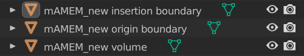
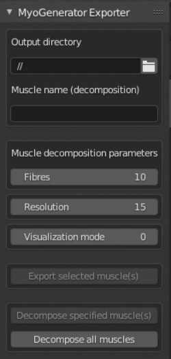
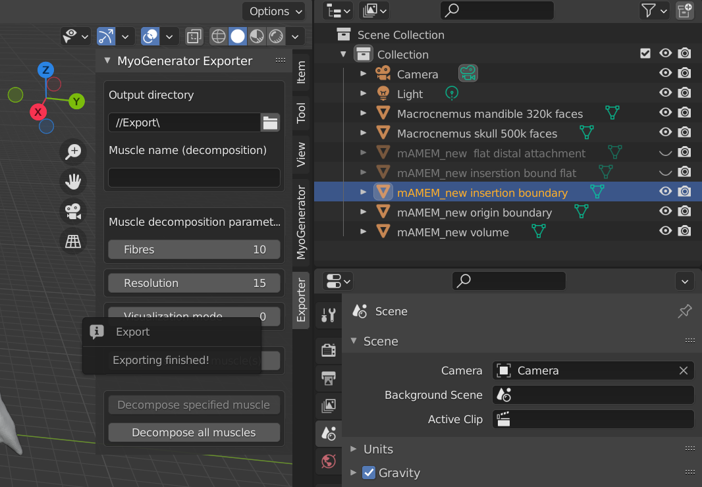
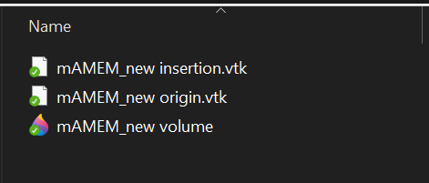
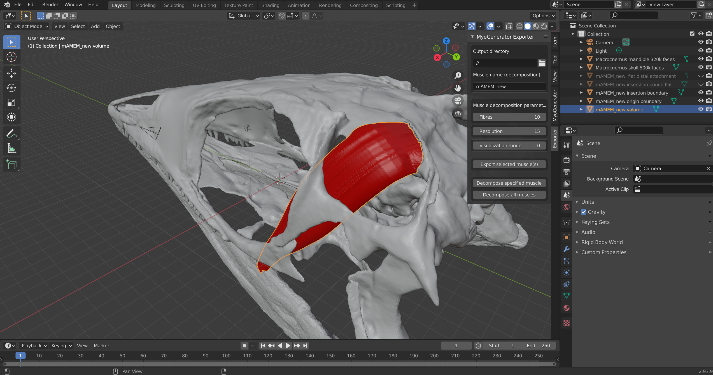
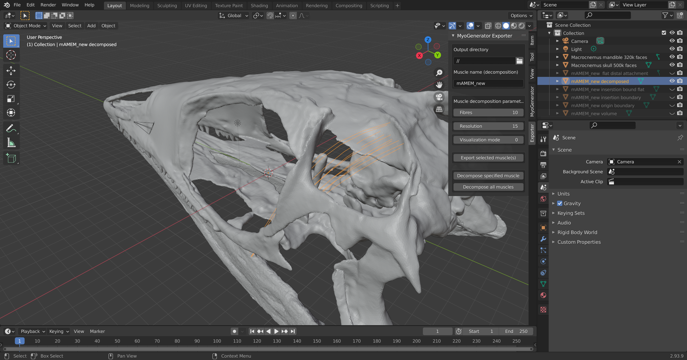
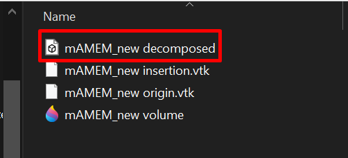

# Introduction
A Blender add-on for use in combination with the [MyoGenerator](https://github.com/evaherbst/MyoGenerator) add-on developed by *Eva C. Herbst*.
It's purpose is to be able to easily export **models of muscles** with their *origin* and *insertion* areas out of Blender and decompose them into **a set of muscle fibres** - a more realistic representation.

It is supported by the Myogenerator add-on version **1.0.0** and Blender versions **2.8X.X - 2.9X.X**

# Installation
To install this add-on, download the intended released version and proceed as follows: [How to install](https://docs.blender.org/manual/en/latest/editors/preferences/addons.html).
After a successfull installation, the add-on should be present on the right vertical add-on toolbar (showed by pressing the **N** key).

# Model hierarchy
For the add-on to successfully decompose a muscle, the user has to create **3** separate models:
- Model of the muscle volume
- Model of the origin area
- Model of the insertion area

The name of the models in the scene **MUST** follow a naming convention: 
- For the volume model:`<muscle_name><space>volume`
- For the insertion area: `<muscle_name><space>insertion<space>boundary`
- For the origin area: `<muscle_name><space>origin<space>boundary`

A proper muscle model could have following hierarchy (in the scene):

 

*The name of the muscle model in this case is mAMEM_new*

# Add-on's quick 
The add-on's GUI is fairly simple:

 
 

 

## Output directory
This parameter is used for selecting a work folder. 
Export and decomposition functionallities are working with **this** directory.

## Muscle name (decomposition)
This parameter serves **only** for the singular decomposition process (Decompose specified muscle(s)).
After pressing this button, the add-on searches for the [essential](#model-hierarchy) files in the current working directory (specified by [Output directory](#output-directory))

## Decomposition parameters
For the decomposition process, following parameters can be set, which implicate the model's structure:
- Fibres: Number of muscle fibres of which the muscle should consist of
- Resolution: Number of segments of each fiber (each fiber is basically a segmented line)
- Visualization mode: 0 - no visualization, 1 - visualization of the decomposition process, 2 - Debug (for development purposes)

# Exporting a model
The [3 separate models](#model-hierarchy) can be exported out of Blender.
To export them, user has to select which of the model should be exported. (*in the object hierarchy in the upper right corner; use CTRL + mouse click to select multiple parts*)
After that, click on the **Export selected muscle(s)** to export all the selected models (and their parts).
The number of models/parts to export is **not** limited.

If the export was successfull, the following pop-up should appear:

>*If a dialog with different a message appears, please proceed to the [Troubleshooting](#troubleshooting) section*

and a new file, in the [working directory](#output-directory), should appear (with the same name).

The export format is **VTK** for the insertion/origin areas, **OBJ** for the volume . 

# Decomposing a model
If a user already has the model parts as files on the disk, the exporting process can be skipped.
For the model decomposition, the files (representing each model(s) part(s)) **MUST BE** present in the [current working directory](#output-directory). After that, a user has **2** decomposition options:
- Decompose specified muscle: To decompose only a **single** muscle, user **has to** specify a name of the muscle (**only the name**). This is partly why the naming conventions need to be complied with.
- Decompose all muscles: The [current working folder](#output-directory) is searched through, extracting every unique muscle name and decomposing all muscles found.

>**IMPORTANT!** Make sure you set the decomposition parameters **BEFORE** clicking on one of the decompose buttons. If you want to change the already decomposed model's parameters, you need to set new ones and press the decompose button again.

After click either of the buttons, the model is imported automatically back into Blender, if the process finished successfully. Also, a decomposed model source file is created in the [current working folder](#output-directory)

>If not, the model is not imported into Blender and one of the possible error pop-ups appears. If that's the case, please proceed to the [Troubleshooting](#troubleshooting) section.

# Troubleshooting
During using the add-on, you might run into a few warnings/errors. Below, there's an available list suggesting a simple troubleshooting:
- *No object(s) selected!*: You have tried to export a muscle (or its part), but you have not selected the model. Make sure the proper object is selected.
  
- *Wrong muscle name format! Model should...*: When exporting, make sure the model is named compliant to the [naming conventions](#model-hierarchy).

- *File was not found! Please, check the filename and directory. (File: ...)*: This error mostly happens, when a user chose a [working directory](#output-directory), but the file is not present. These pop-ups should always contain a path to the file, which was not found, so make sure to check if the path is right and if the file is in the correct folder.

- *No muscles to decompose found in the specified directory*: [Current working directory](#output-directory) is most likely empty. Make sure, you're in the right tdirectory. If it is not empty, make sure you're following the [naming conventions](#model-hierarchy)

- *MuscleDecomposition executable has not been found ...*: For decomposition, there's an essential tool in the add-on's source files. Open your file explorer and navigate to your Blender's add-on's folder (default: %appdata%\Blender Foundation\Blender\<version>\scripts\addons\Myogenerator\_Exporter\Assets). In this folder, there should be a file named **MuscleDecompositionTest** (*.exe* for Windows platform). Most likely, it is missing. This issue should be easily fixable by reinstalling the add-on, or download the executable from the source files (Windows only build) and copy it into the mentioned folder.

  > If you're using Linux, you will need to head to [this link](https://gitlab.com/besoft/muscle-wrapping-2.0) and build a MuscleDecompositionTest executable for your concrete platform and distribution.

- *Decomposition has been aborted due to the following reason:*: Something went wrong during the decomposition process. Try to decompose a muscle with **visualization mode = 2**, screenshot the console output and open an issue on the [GitHub repository](https://github.com/HarryHeres/MyoGenerator-Exporter).

If you have run into other errors, please feel free to open an issue on the official [GitHub repository](https://github.com/HarryHeres/MyoGenerator-Exporter) :-).
